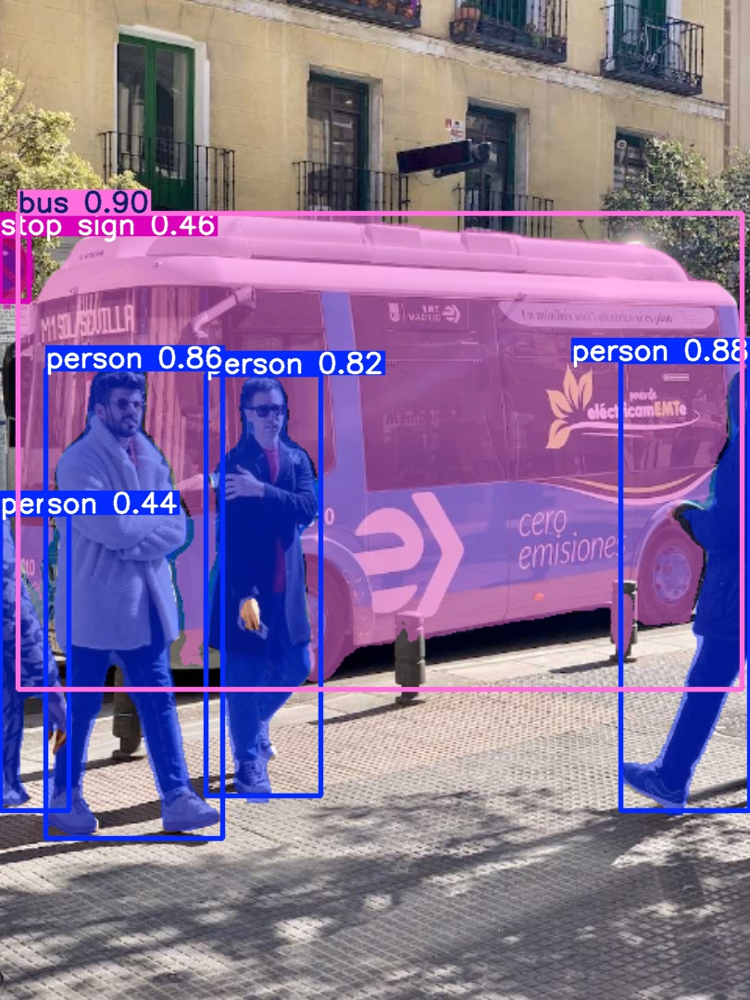

# Instance Segmentation Using YOLOv11

## Overview
This repository demonstrates how to perform **Instance Segmentation** using **YOLOv11**. The project focuses on accurately detecting and segmenting objects in images and videos while maintaining high efficiency.

## Features
- **Real-time Instance Segmentation**: Fast and accurate segmentation of multiple objects.
- **Optimized for Performance**: Balances speed and accuracy for practical applications.
- **Supports Images & Videos**: Works with both static images and real-time video streams.
- **Custom Dataset Compatibility**: Easily train on your own dataset using Ultralytics YOLOv11.

## Installation
To set up the environment and dependencies, run the following commands:

```bash
# Clone the repository
git clone https://github.com/muhammadrizwan11/Instance-Segmentation-Using-YOLOv11.git
cd Instance-Segmentation-Using-YOLOv11

# Install dependencies
pip install ultralytics
```

## Usage
### 1. Running Segmentation on an Image
```bash
!yolo segment predict model=yolo11n-seg.pt source='https://ultralytics.com/images/bus.jpg'
```

### 2. Running Segmentation on a Video
```bash
!yolo segment predict model=yolo11n-seg.pt source='path_to_your_video.mp4'
```

### 3. Training the Model on Custom Dataset
To train YOLOv11 for segmentation on your own dataset, use:
```python
from ultralytics import YOLO

# Load the model
model = YOLO('yolo11n-seg.pt')

# Train on custom dataset
model.train(data='your_dataset.yaml', epochs=50, imgsz=640)
```

## Results
### Sample Prediction
Below is a sample result of instance segmentation using YOLOv11




[Watch the video](full.mp4)

## Repository Structure
```
Instance-Segmentation-Using-YOLOv11/
│── Instance_Segmentation_Using_YOLOv11.ipynb  # Jupyter Notebook with code
│── predicted.png                               # Example prediction output
│── README.md                                  # Project documentation
```

## Acknowledgments
- [Ultralytics YOLO](https://github.com/ultralytics/ultralytics) for providing the YOLOv11 framework.
- Open-source datasets and research contributions in instance segmentation.


For any issues or contributions, feel free to create a pull request or open an issue!

